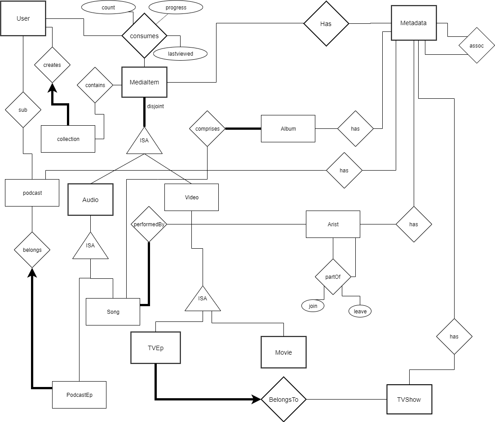

# MediaServer Web App

## Table of contents
* [General info](#general-info)
* [Screenshots](#screenshots)
* [Technologies](#technologies)
* [Setup](#setup)
* [Features](#features)
* [Status](#status)
* [Inspiration](#inspiration)
* [Contact](#contact)

## General info
The media server is designed to keep track of files and metadata information regarding various audio and video media.
* Movies
* TV Shows (which have TV Episodes)
* Songs (which are performed by Artists and appear in Albums)
* Podcasts (which have Podcast Episodes)

There is also some User Account information which contains information about the user including:
* Contact Methods
* Username / password
* Subscribed podcasts
* Consumed media

We have abstracted most of the common elements such descriptions, artwork and genres into a new MetaData table system.

## Screenshots

Credit: Baocheng Wang

## Technologies
* Tech 1 - Python3
* Tech 2 - MySQL
* Tech 3 - Flask
* Tech 4 - HTML

## Setup
Preconditions:
* Please make sure that you have Python3 installed in your local environment.
* You will need to connect to the USYD student VPN, as the web is running based on the private server of University of Sydney.

You will need to pull the project from the remote repo to your local environment by entering:

`git pull https://github.com/billyjojojobulido/MediaServer.git`

To run the project, you will first need to move to the following directory:
`cd assignment_webapp`

And then enter the command:
`python3 main.py`

You will have the following response in your terminal:

----------------------------------------------------------------------
Welcome to Media Server Backend.

             Please open your browser to:
             http://127.0.0.1:5000
----------------------------------------------------------------------

Quit the project by `Ctrl + Z`

## Code Examples
Show examples of usage:

`put-your-code-here`

## Features
List of features ready and TODOs for future development
* Awesome feature 1
* Awesome feature 2
* Awesome feature 3

## Status
Project is: _finished_
Client: Matloob Khushi
Feedback: Accepted

## Inspiration
Project inspired by , University of Sydney, Harshana Randeni
based on https://github.sydney.edu.au/ISYS2120-Assignments/2020-s2-a03-media-server
design by W12A_Group3_Asm3
* Baocheng Wang bwan3675  leader
* Yuchen Shen   yshe6908  core developer
* Oliver Lin    jlin8876  tester
* Zizheng Wei   zwei8850  front-end developer

## Contact
If you have found some issues or concern with this project, please feel free to contact the team leader: Baocheng Wang 
via baocheng0121@gmail.com
